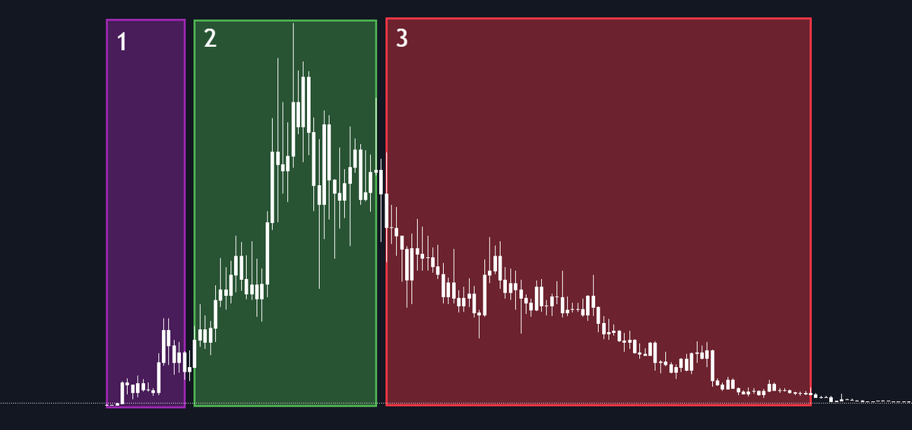
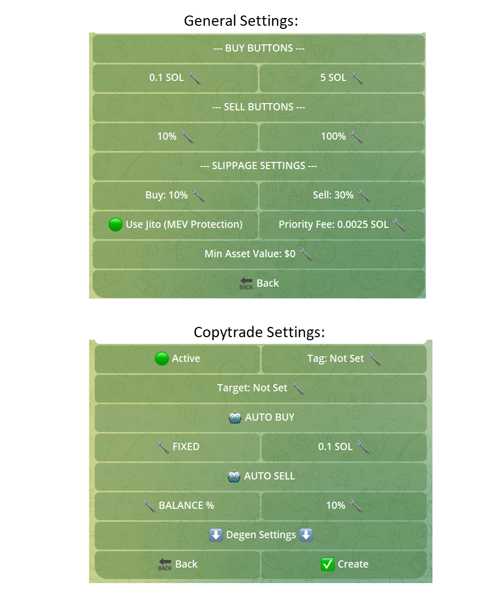

# solity-bot

## [ Introduction ]
Total meme market cap = $117B (3.7% of crypto mc). Memes are the DeFi of this cycle, but the truth is... 90% of the coins released are literal trash.



And the remaining 10% follow the same pattern:

- Insiders buy in early
- X shill
- Insiders cash out

If everyone is already talking about a meme coin when you hear about it – it's already too late.

## [ Build a Bot ]
### 1. Degens sources on Twitter that we use:

- [@Danny_Crypton](https://x.com/Danny_Crypton)
- [@DefiWimar](https://x.com/DefiWimar)
- [@CryptoNobler](https://x.com/CryptoNobler)
- [@0x_Discover](https://x.com/0x_Discover)
- [@0xPhilanthrop](https://x.com/0xPhilanthrop)
- [@0xPepesso](https://x.com/0xPepesso)

Head to: http://chatgpt.com

Request to write Python code for analyzing info from Twitter lists. This code sorts tokens by their Twitter buzz. Here's the prompt I used:

```
As a Python programmer with 5 years of experience in web development and website scraping, write code that will analyze information about popular narratives and tokens from this Twitter list: {your Twitter list link here}
```

https://github.com/user-attachments/assets/7160ab22-94b7-4a76-b932-b562ff621ff1

### 2. Now, let's track new tokens on Pump Fun.

Ask GPT-4.0 to write Python code that pulls token data from https://pump.fun/board. Once the code is ready, add filters to separate the gems from the junk.

https://github.com/user-attachments/assets/2cde2d81-5d5e-4c0e-9034-3c9cb7a7f6a0

### 3. Rate the project's Twitter

Have GPT write code to assess the quality of the Twitter audience using "https://app.tweetscout.io". The code should analyze the number of influencers and degens among the followers.

https://github.com/user-attachments/assets/b2303428-6abc-4577-b1ac-e3f7a94d8d34

### 4. Score token CA

- Use "https://rugcheck.xyz" to check each CA.

The contract should be marked as "Good," and top holders shouldn't control a large portion of the supply. The basic bot setup is complete and you can add more advanced filters at this stage, but I'll show you how to do that later. 

https://github.com/user-attachments/assets/7dad3891-13e0-4914-8f45-fcd0a9f88237

### 5. Token buying is a key part of the code

- Have ChatGPT write Python code to quickly purchase tokens via Trojan Bot

When the bot identifies a potential 100x play, it sends the token's CA to Trojan Bot. For this to work smoothly, you'll need to configure Trojan.

https://github.com/user-attachments/assets/892a303e-236e-43e1-999b-ed6aba0a4f80

### 6. Trojan setting

General Settings:

- Head to: https://t.me/toxi_solana_bot?start=ref-danny
- Priority Fee: 0.0025 SOL
- Use Jito (MEV): On
- Slippage buy: 10%
- Slippage sell: 30%

Copytrade Settings:

- Auto Buy: On
- Auto Sell: On



### 7. Final step

- Ask GPT to merge all previous code samples into the final bot.

Merged code will automatically pick tokens from Pump Fun and analyze them based on Rugcheck results, Twitter score, and Twitter list.


https://github.com/user-attachments/assets/b7d490d0-98ec-4295-b6b0-613e2b3e672c

To boost your win rate, ask GPT-4.0 to add these features:
```
- Number of whales holding the token
- Has the dev sold their tokens?
- Is the Dex paid or not?
```